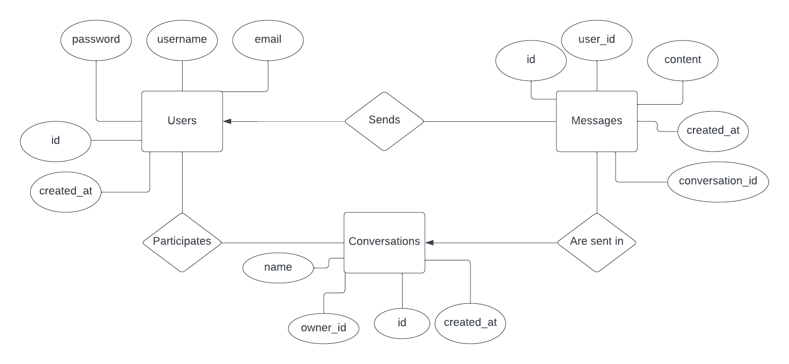

# chat-app-dis

## Run the project

To run this project you must install node.js (latest recommended)

1. Make sure to have the .env file with the correct variables at the root of the project
2. Navigate to the root of the project
3. Install the project dependencies:

```zsh
yarn install
```

4. Run the project and set up the database schemas (if they do not already exist)

```zsh
yarn run dev:mac
```

If on Windows, you may need to run the following command instead:

```zsh
yarn run dev:win
```
The project should now be running at `localhost:4000`. If not, In the dist folder you will find the compiled version javascript of the project. The sql files to create the database schemas should have been copied to `dist/src/database/sql` by running the project. If not, you can copy them manually from the `src/database/sql` and then run:

```zsh
yarn run dev
```

The project should now be running at `localhost:4000`

## Frontend

The frontend that consumes this API can be found at [chat-app-web](https://github.com/a-lundsgaard/chat-app-web).

A live demo of the app can be found [my-chat.herokuapp.com](https://my-chat.herokuapp.com/).

## ER Diagram

